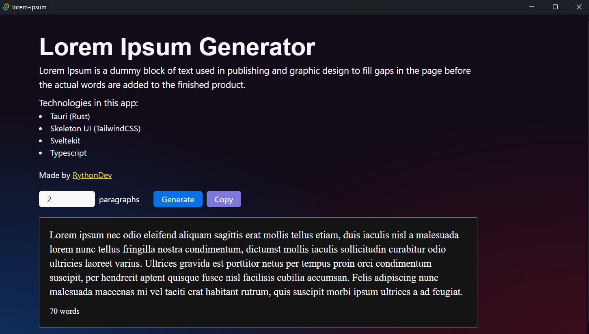

# Lorem Ipsum Generator App



A simple Lorem Ipsum Generator desktop application, built with Tauri, Sveltekit + Skeleton UI 


## Installation

1. Clone repository

```
git clone https://github.com/liyunze-coding/lorem-ipsum-app.git
```

2. Either:

Install with Bun

```
bun install
```

OR

Delete `bun.lockb`, then install with:
```
npm install
pnpm install
deno install
```

Build it into a desktop application by doing:

```py
bun run tauri build # Or npm, pnpm, deno
```

3. Create `.env` file and put it in the `src-tauri` directory. Define your [API Ninjas](https://api-ninjas.com/api/loremipsum) API key.

```
API_KEY=INSERT-API-KEY-HERE
```